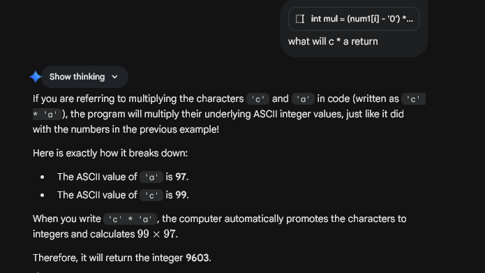

Core logic: Multiply by hand.

How to convert String into int without any built in function:

``` 
int mul = (num1[i] - '0') * (num2[j] - '0');
```
In programming languages like Java and C++, characters are actually stored as numbers behind the scenes using a system called ASCII (or Unicode).

In the ASCII table, the digits '0' through '9' are stored as sequential integer values:

- '0' is stored as 48

- '1' is stored as 49

- '2' is stored as 50

...and so on up to '9' which is 57.

When you subtract the character '0' from another number character, the computer performs the math using their underlying ASCII integer values.

Here is an example:
If you have the character '7' and you want to convert it to the actual integer 7, you do '7' - '0'.
Behind the scenes, the computer calculates:
55 (the ASCII value of '7') - 48 (the ASCII value of '0') = 7

- what will c * a return


