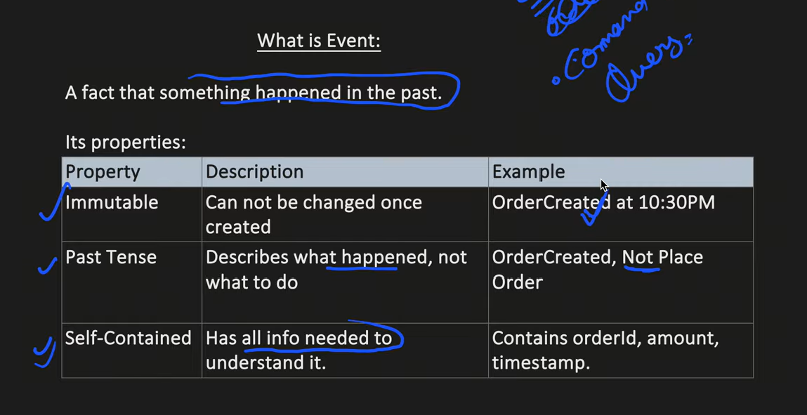
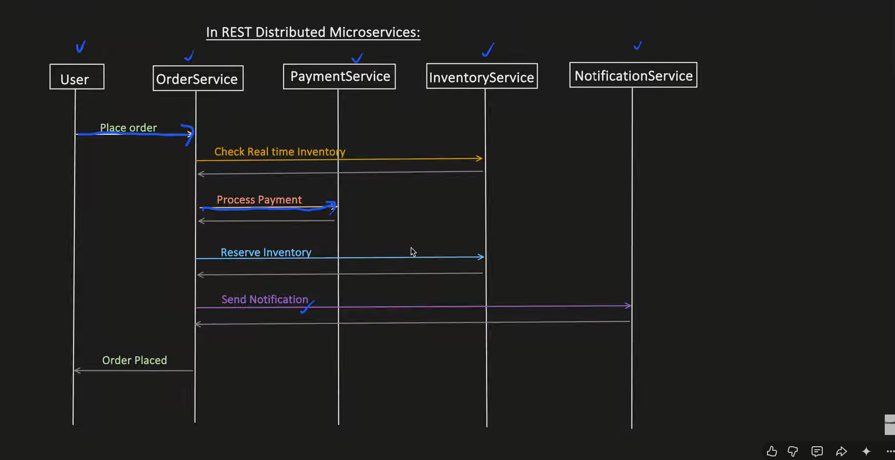
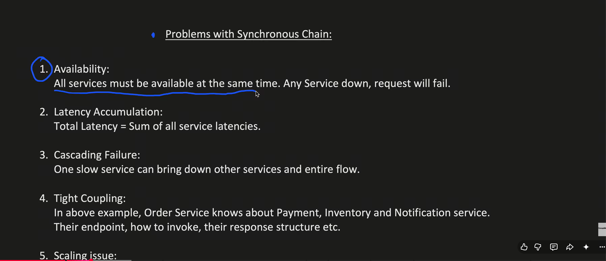
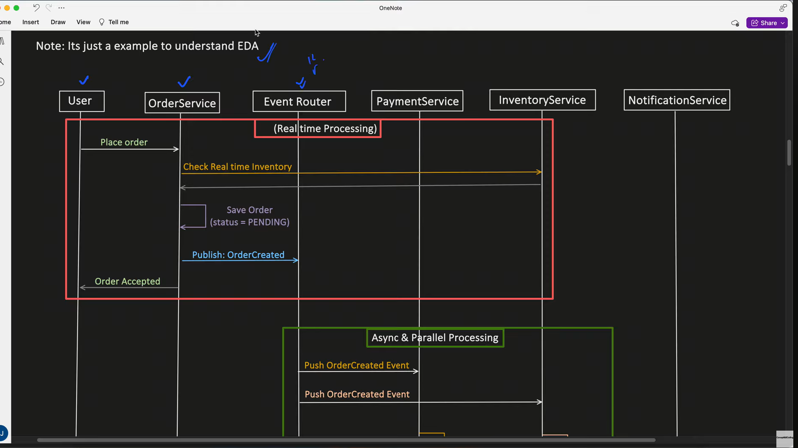
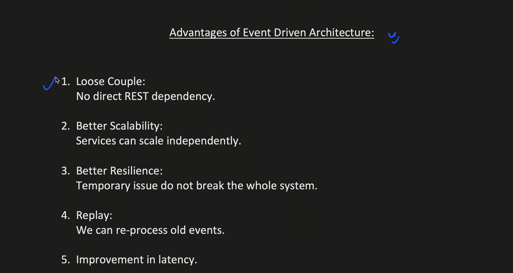
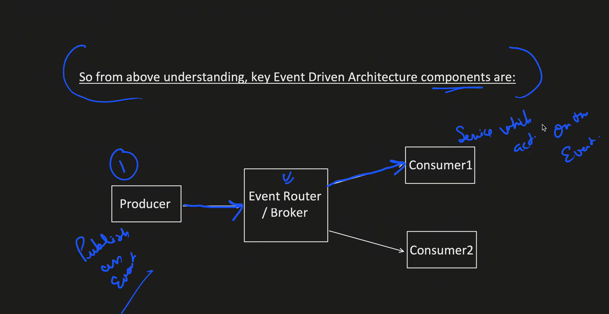
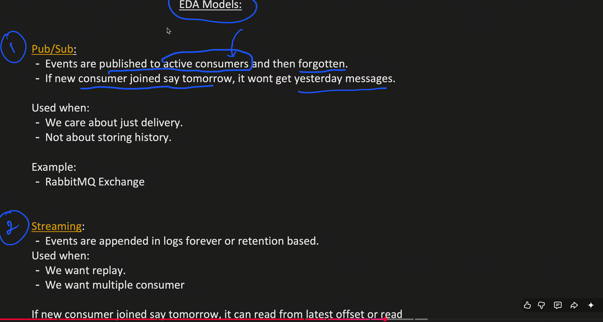
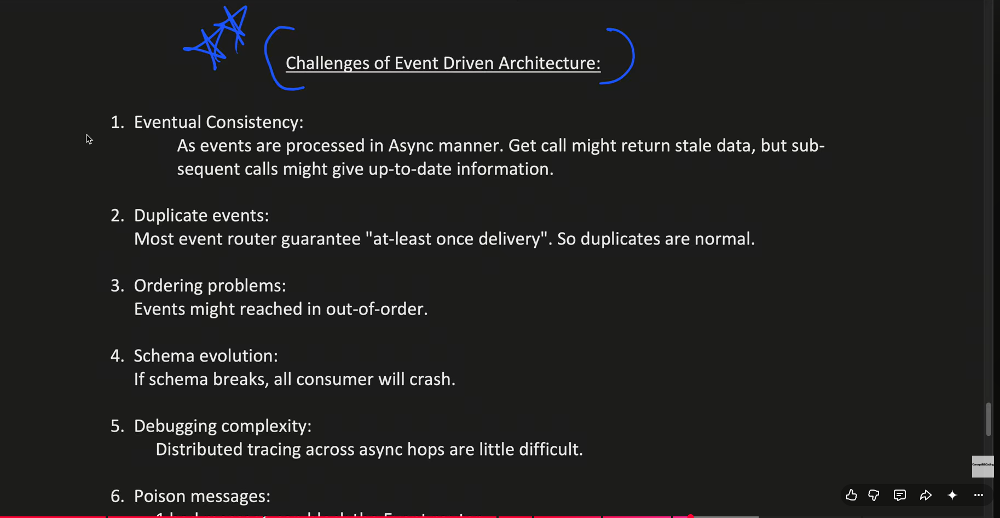

**1. Explain Architecture, Event driven architecture?**

-Services donot call each other directly, instead services emit events and other services react to 
those events. (Listner and Queues)

-Event : fact that has happened, not something that needs to be done.

-

- Problems of Synchronous communication.
- 

Event Driven Architecture:

Advantages of EDA:

Main components of EDA:

How do events move in EDA?
- Push model: Broker pushes messages. Consumer handles the rate.
- Pull Model: 

-EDA Models:

Streaming example: Kafka.

Challenges of EDA:

