**JWT**
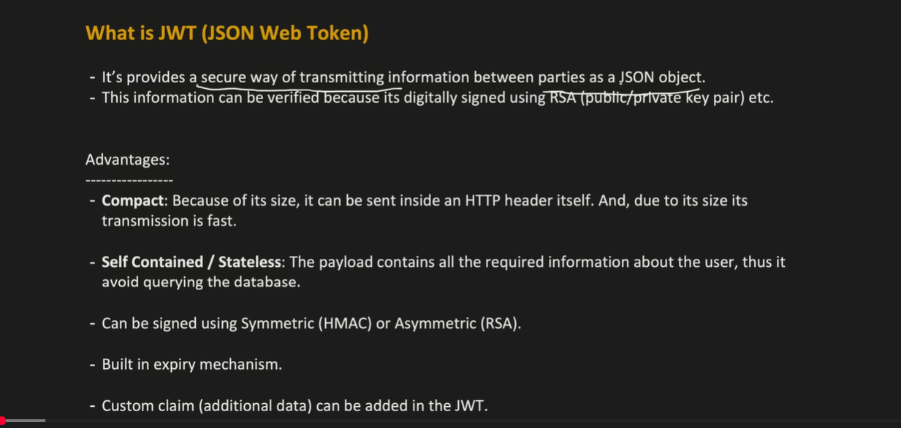

JWT was made for secure data transfer, but over the years it is used for many other purposes:

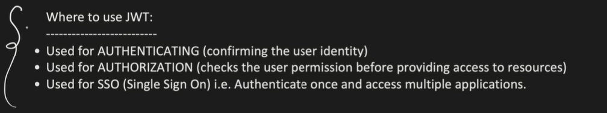

Authentication flow of JWT:
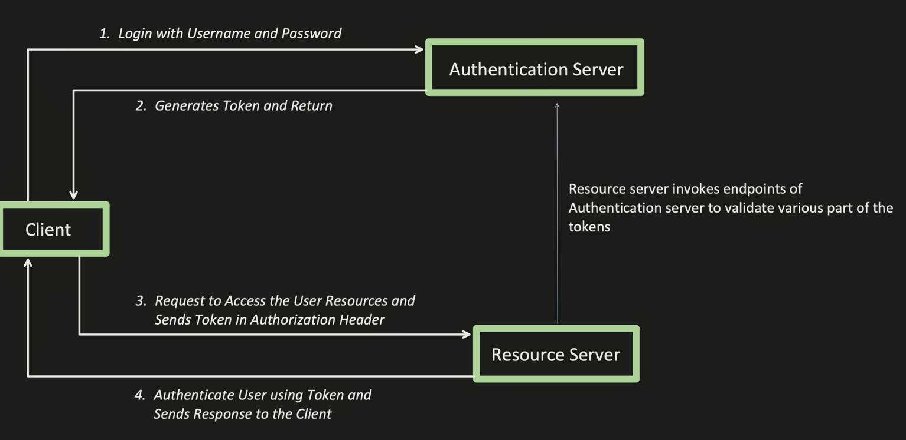

Auth server - 3rd party lib to genrrare and validate token 

- client provide username / password
- Auth server generated token and return to client
- client will call the resource server and pass JWT in the authorization  header.
- resource server will call the auth server and pass the token
- resource will grant permission and return the data.

Before JWT there was session id:
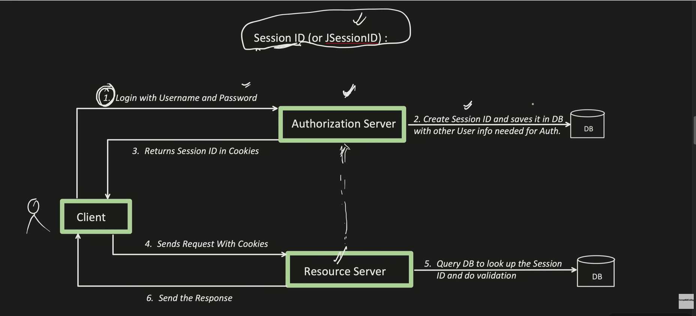

Disadvantages:
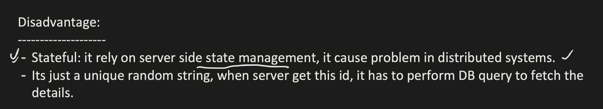

JWT Structure:

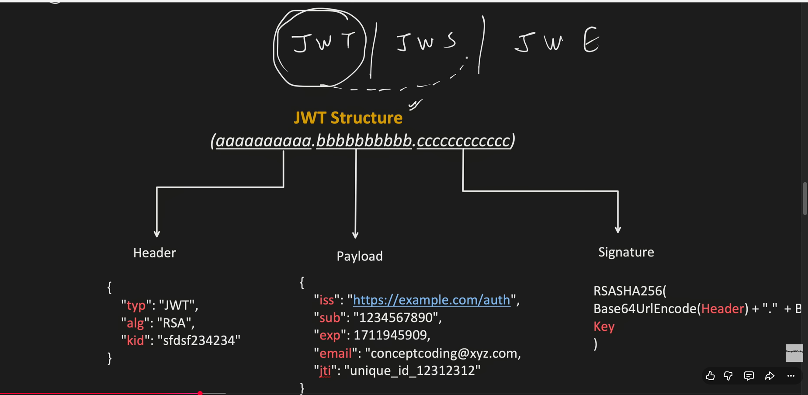

- Header
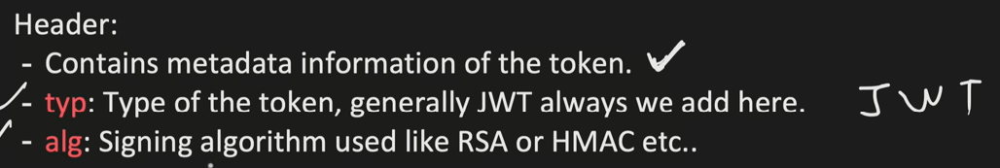

-Payload: holds claims:
Types of claims:
Registered Claims: names are reserved
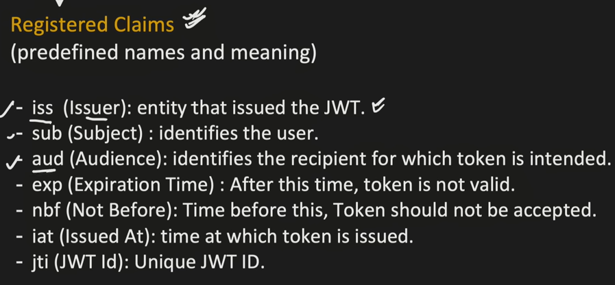

Public claims: email, country. Never put 

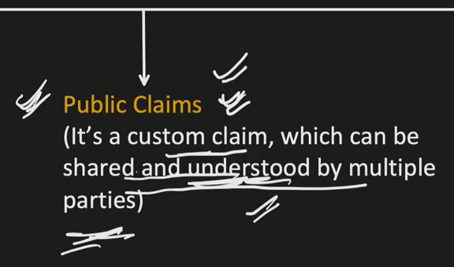

Private claim: auth server understands. ex: IAM
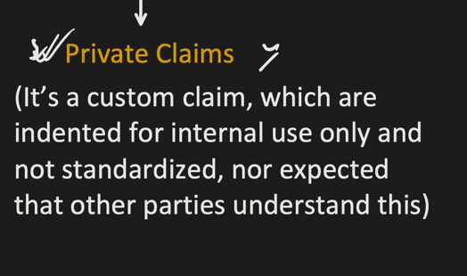

Signature (JWS) Json Web Signature:

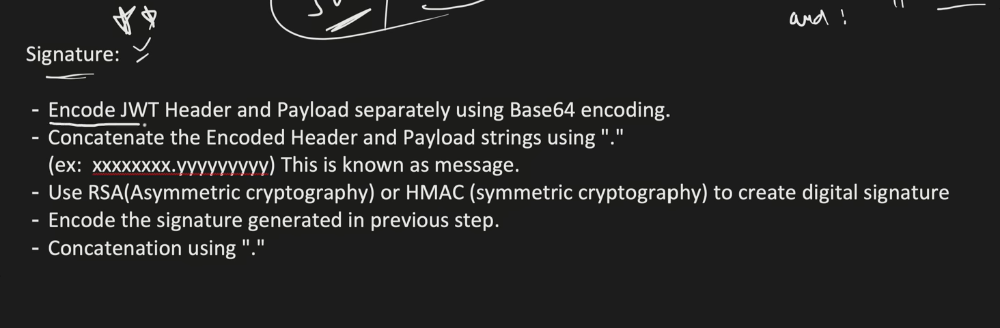

How is signature created: 
- Encode Base64 Encodinfg for header and payload and concatenate these two using . period
- create signature by using RSA or HMAC encryption
- encode signature and append to header and payload

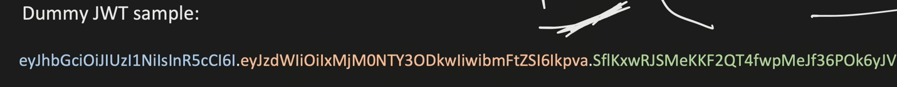

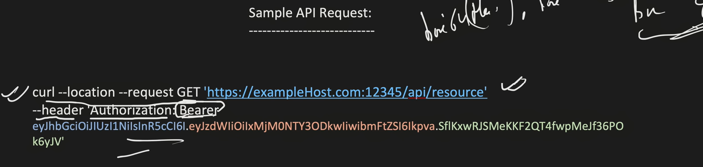

Challenges of JWT:
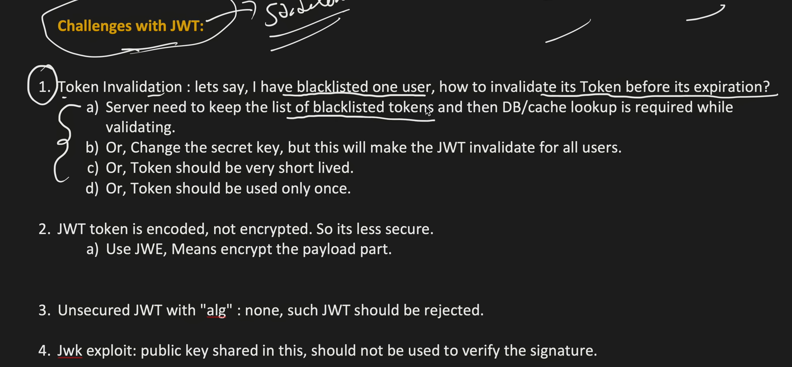

 
**JWT IMPLEMENTATION**

- User Creation
- Token Generation
- Token Validation
- Refresh token

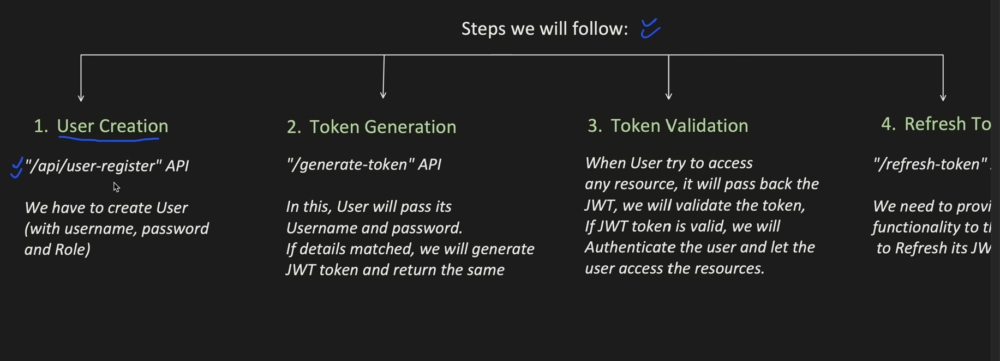

