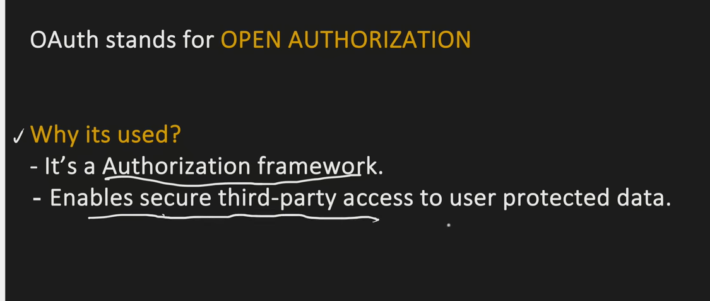
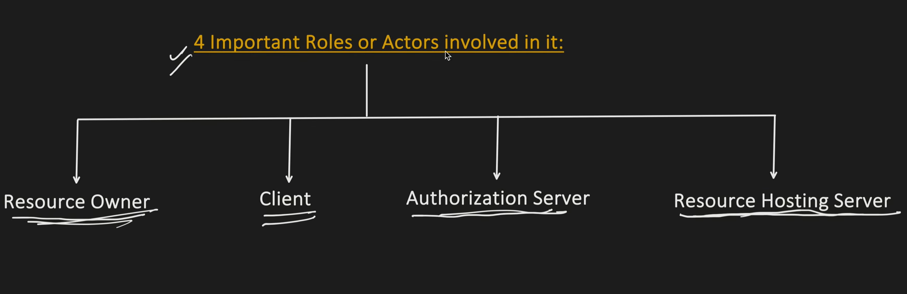
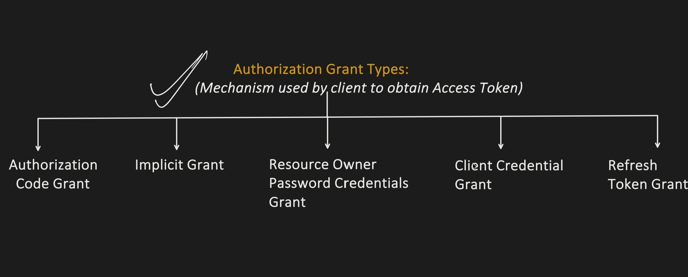
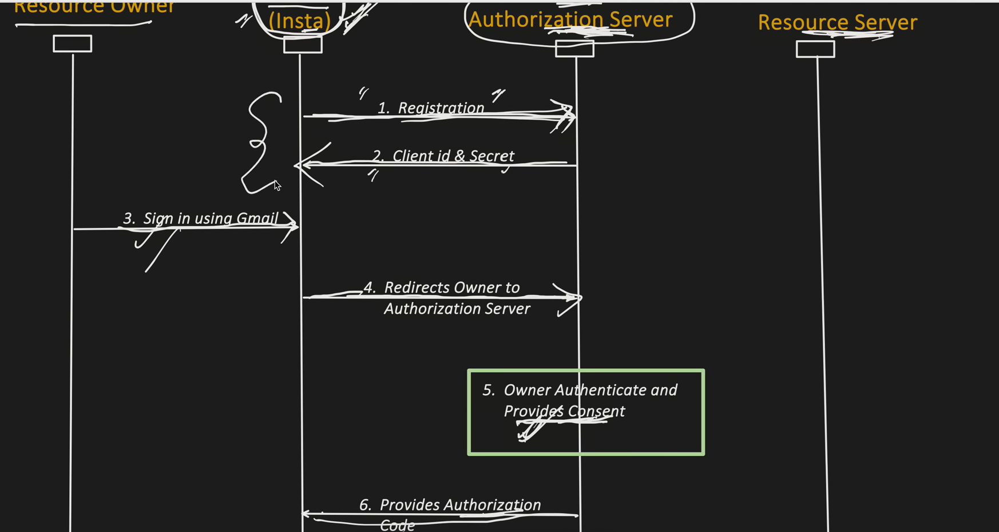
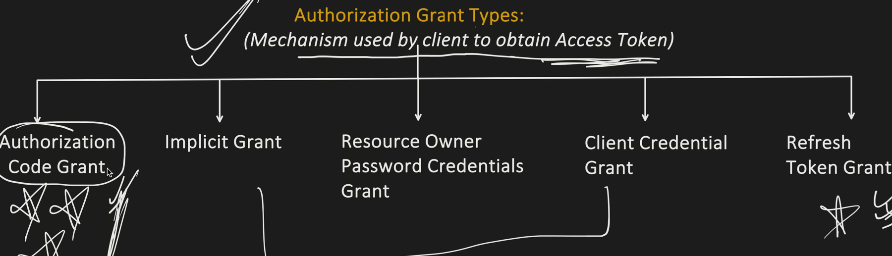
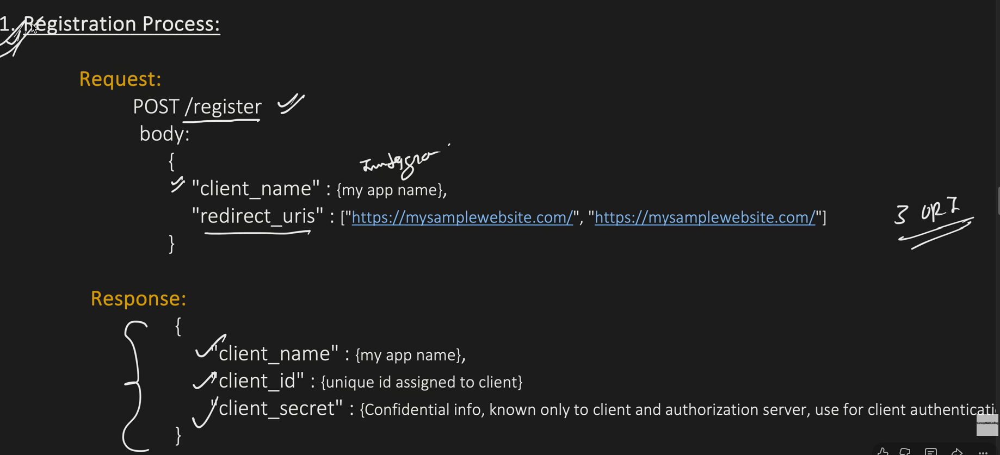
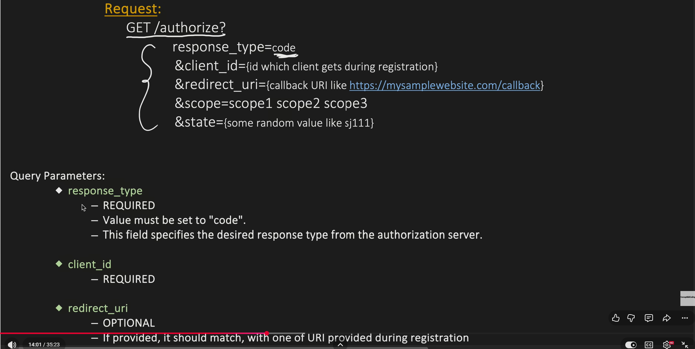
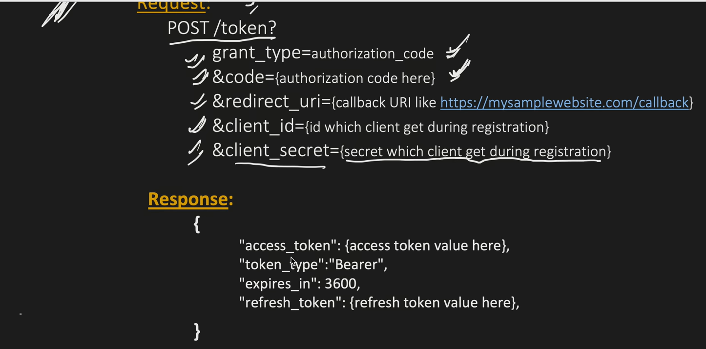
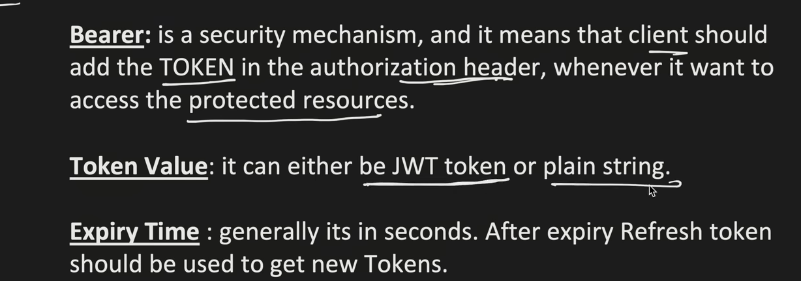

What is OAuth

- User has a gmail account.
- wants to sign in to a different website
- uses option sign in using gmail - authorizes the 3rd party to use protected gmail data
- gmail provides the secure data based on authentication info given by client to 3rd party.

Example Flow:

Auth Grant Types:

1. Registration process:

2. fetch auth code:

3. Fetch Token

4. Once token is received 3rd party website can access gmail data.

