**Common Attacks:**

1. CSRF:
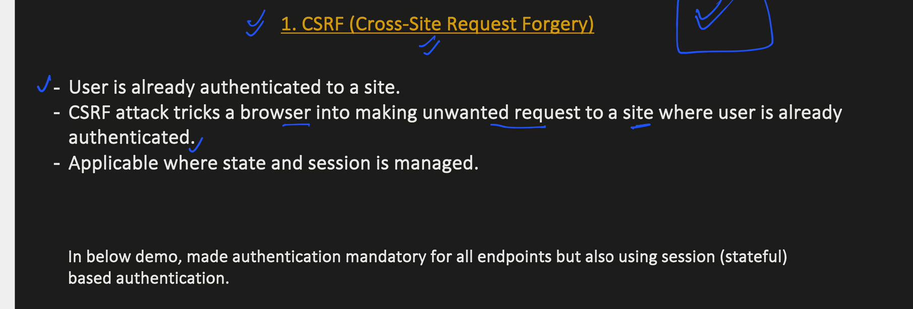

- a link tricks user to click and redirect to a site where you are already authenticated like gmail.
Example:
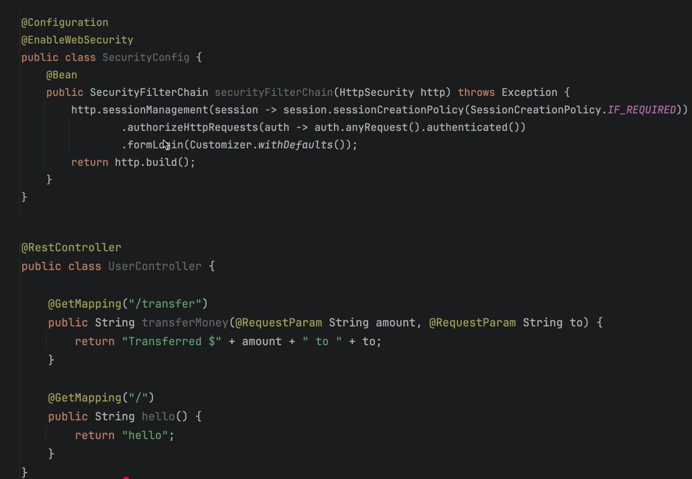

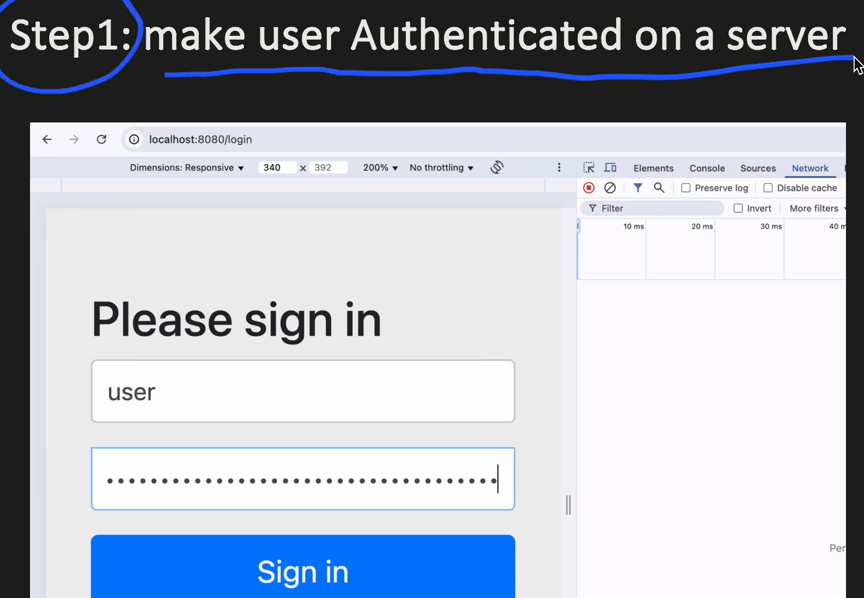

Browser automatically adds the session in the cookie.

How to get protected from CSRF token:

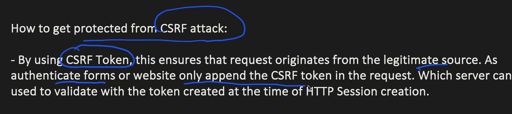

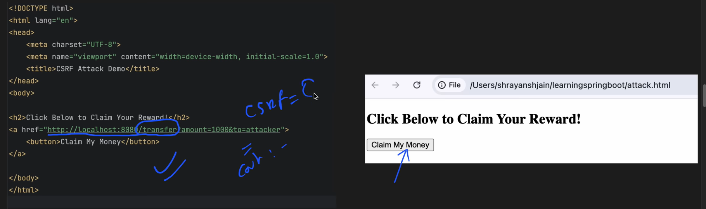

**2. XSS Cross-Site Scripting:**
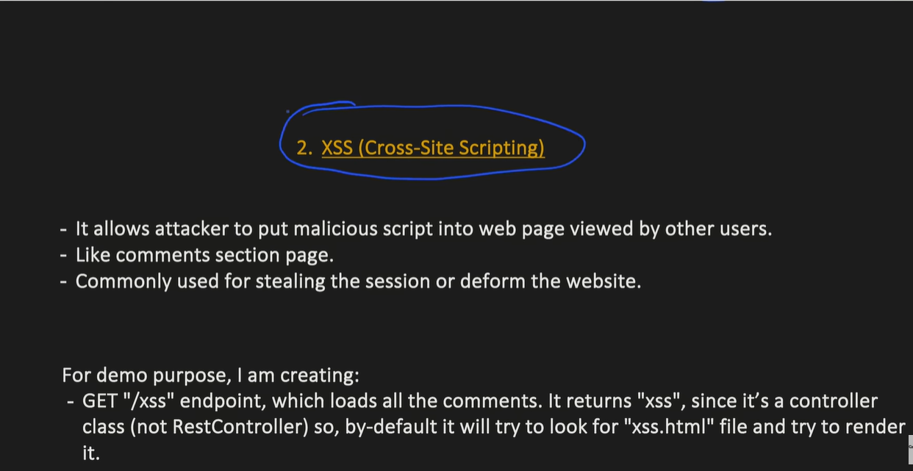

Example: A page where user can add comment.
- Get endpoit to get all comments from DB
- POST endpoint to add a new comment.
- Attack happens by inserting malicious code as comment that can deform a website.

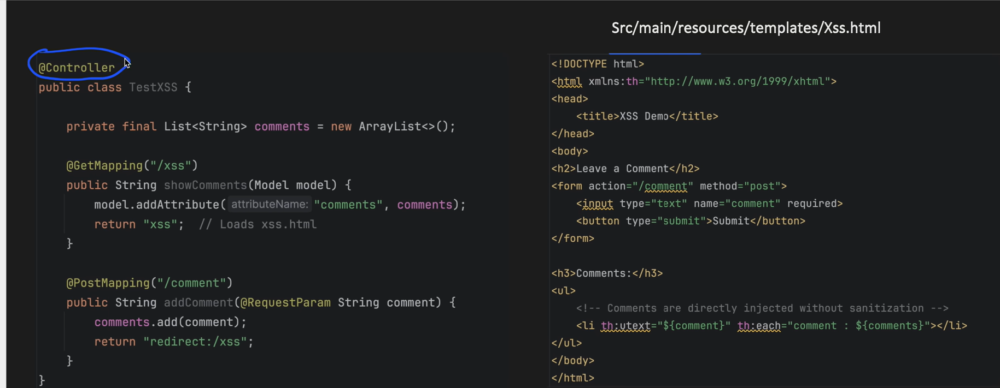

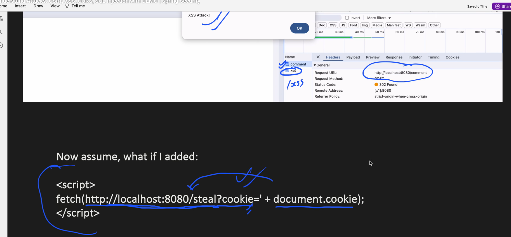

How to Prevent this attack:

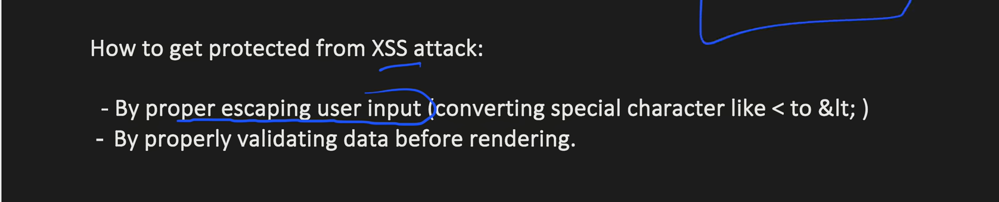

3. CORS 

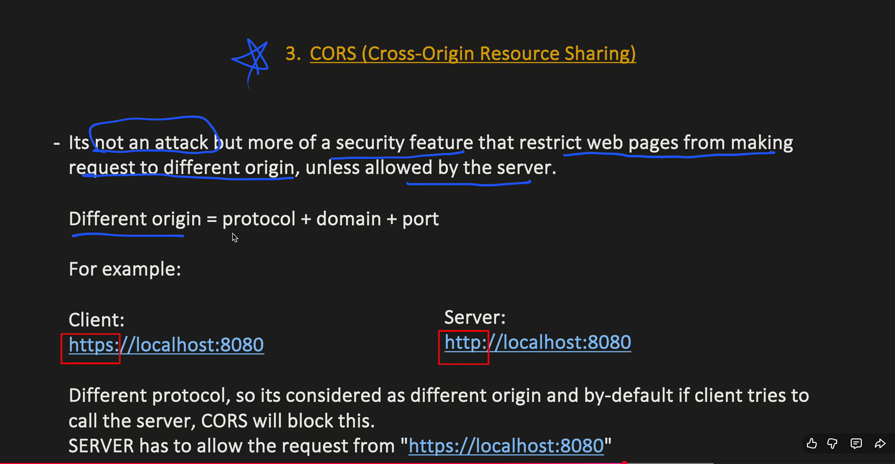

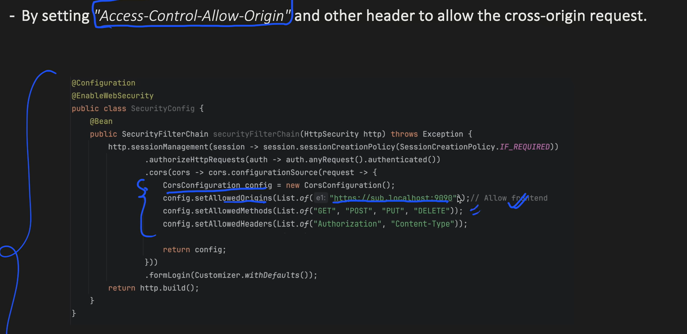

4. SQL Injection:

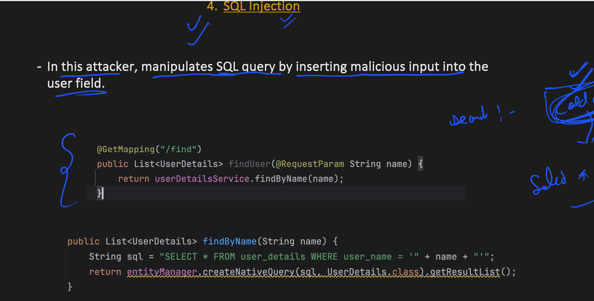

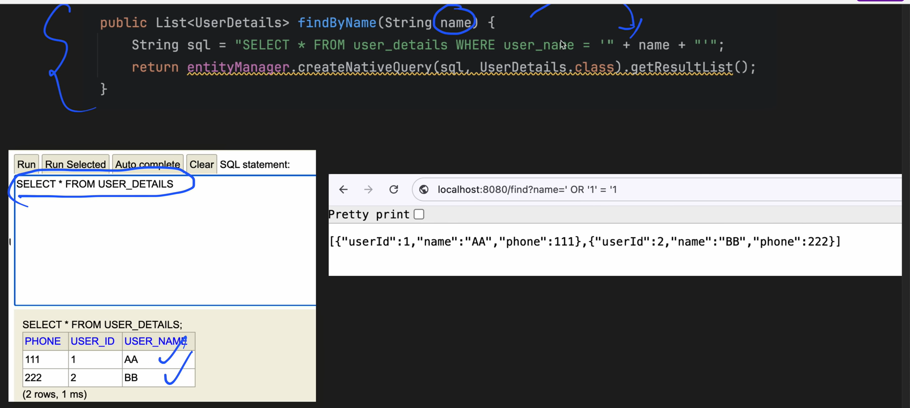

How to prevent:

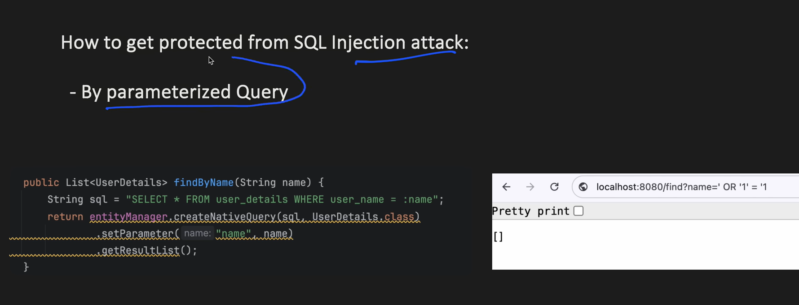

**Spring Security 1:**

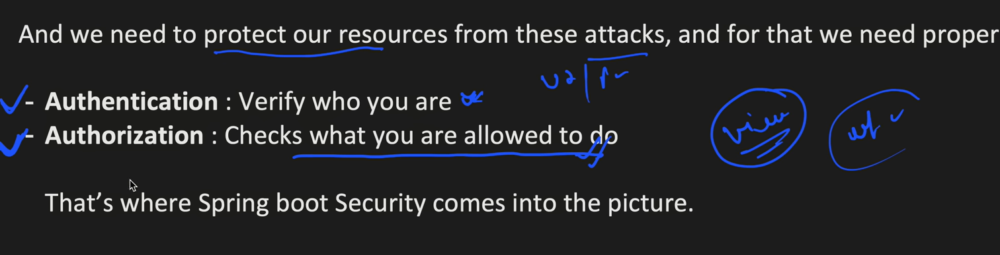

Architecure:

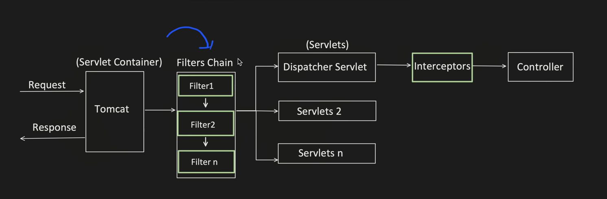

There are multiple security filters
For each authentication method there are different filters.

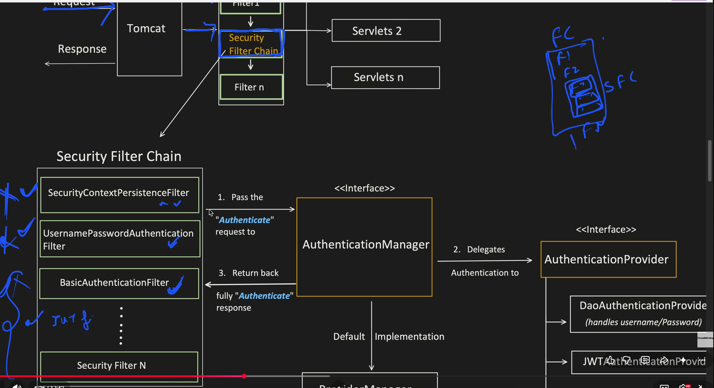

AuthenticationManager ----> ProviderManager -----> AuthenticationProvider

